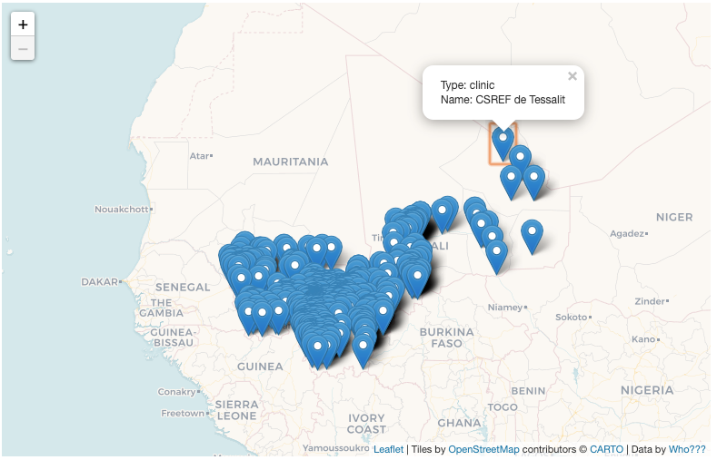
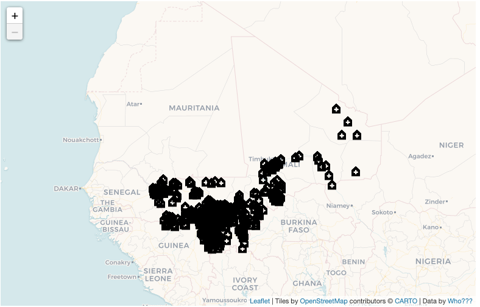
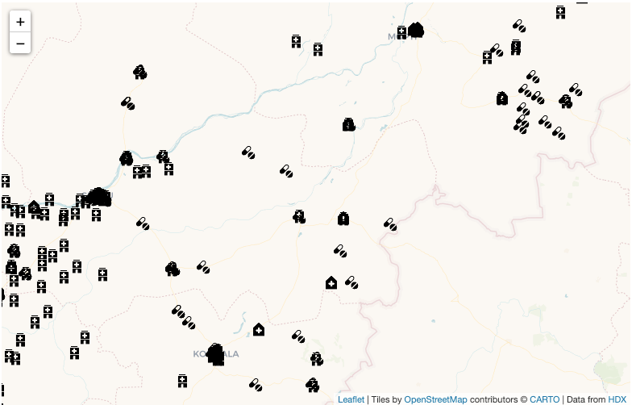
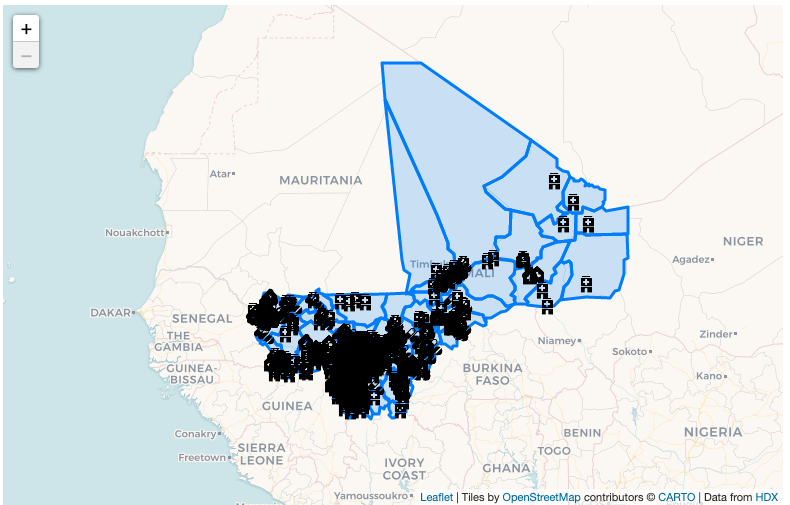
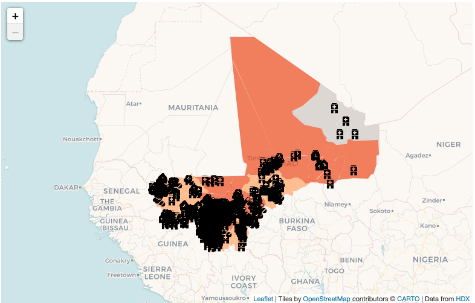
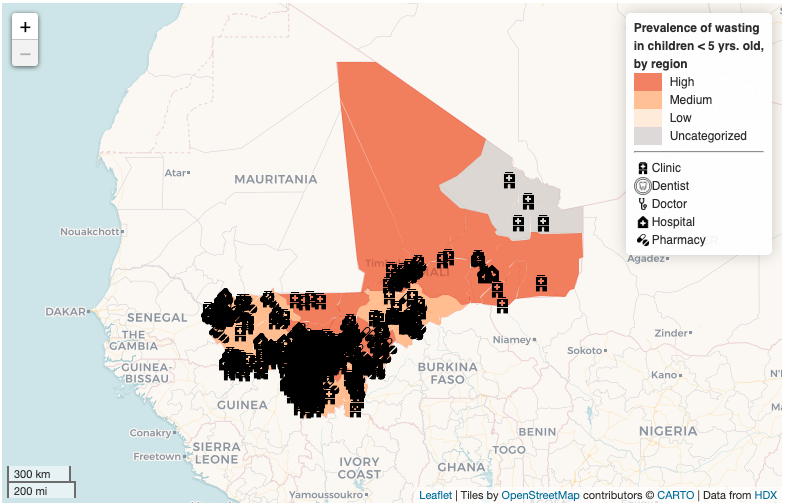

# Mali Health Maps

Context, importance...
structure of a web page?

## The Data
Stuff about data...
Add  `REAMDE` to data folder...

## Map Set Up & Adding Data

Here you will see our HTML, with some CSS styling at the top, a couple of `div` page elements for our map components, linked scripts, and custom scripts. The page elements are as follows:

- `wrapper`: the main container for our map in the body. Our whole map and interface will fall inside the wrapper element.
- `header`: an element in which we can put the title of our map.
- `map`: the element our map will be attached to.
- `controls`: the element in which we can put any buttons or controls.
- `narrative`: an element inside controls where we can put a brief explanation about the map to help the viewer.

Within the `script tags`, I've added the map object and tile layer. These should be extremely familiar since this creates our map object and adds a basemap. Keeping in mind that our audience is potentially French speaking, or working with geographic references to places with French names due to the colonial history of Mali, is there a better tile set we can use? If you need some starting options have a look at the [Leaflet Providers Overview](https://leaflet-extras.github.io/leaflet-providers/preview/). You will also need to re-center the map and change the `attribution:` of the map to include the new tile set and the data provider! Also consider the `min` and `max` zoom levels: this is a good place to control the scales at which your map operates.

Now let's add our data. I have included the jQuery library in our document so we can use an Asynchronous call to get external data using AJAX and the `$.getJSON` to get our data from an external location. [AJAX](https://en.wikipedia.org/wiki/Ajax_%28programming%29) is one of the languages we looked at very early on in discussions about client/server relationship. In the data folder you will find two datasets. First we'll add `Mali_healthsites.geojson`. At the end of our script, within the script tags, enter the following code to add the data and bind a popup. We want our pop up to display the name of the health site from the feature properties in the geoJson. Even better would be if we displayed _both_ tye type of establishment (`amenity`) _and_ the name.

```javascript
// Null variable that will hold Healthsites data
var Healthsites = null;

// Get GeoJSON and put on it on the map when it loads
$.getJSON("data/Mali_healthsites.geojson",function(data){
    // set Healthsites to the dataset and add the Healthsites GeoJSON layer to the map
    Healthsites = L.geoJson(data,{
		onEachFeature: function (feature, layer) {
			layer.bindPopup(); // What's missing here?
		}
	}).addTo(map);
});
```
The `Healthsites` variable will hold the contents of our GeoJSON so we can refer to it easily. Save and refresh your map. You should see the points populate.



<!-- If referring to URLs - remember that you'll need to enable your repo with GH pages _and_ upload your data before rendering it: otherwise, the URL for the data won't exist yet! -->

## Customizing Point Markers
The point markers showing the Health sites are the default blue Leaflet map pins. These are okay, but it's always nice to customize your map. And, if you are showing multiple properties (i.e. tyipe of amenity) or want to create unique symbols, you can set your point symbols to be represented by an icon of your choosing. The steps towards doing this are quite easy, and you can use the [Leaflet icon class](https://leafletjs.com/reference-1.7.1.html#icon) to set up your parameters. You have a few choices for your custom icons:
- [Mapbox Maki](https://github.com/jseppi/Leaflet.MakiMarkers): this Leaflet plug-in allows you to use icons from the [Mapbox Maki library](https://labs.mapbox.com/maki-icons/). You will need to use your Mapbox API token for this.
- [Font Awesome](https://github.com/lvoogdt/Leaflet.awesome-markers): this Leaflet plug-in allows you to use the open source [Font Awesome icon library](https://fontawesome.com).
- Create your own! You can make your own icons by using an existing image or creating one and uploading it to your server. A great place to get fantastic icons is the [Noun Project](https://thenounproject.com/). In fact, the [U.N. Office for the Coordination of Humanitarian Affairs](https://www.unocha.org/) (or OCHA) maintains [a standard set of icons on the Noun Project](https://thenounproject.com/ochavisual/collection/ocha-humanitarian-icons-v02/)!

The unique values for `amenity` are `clinic`, `dentist`, `doctors`, `hospital`, `pharmacy`. Find the OCHA icons for these values and load them into a folder in your repo called `icons`. Our icons will be small so download the 100px size. If the OCHA set doesn't have the icons you're looking for, search around to find what you want to use: be mindful of the licensing requirements for some icons!

### Create a holder for your custom icons
The first task is to create an object that will hold your custom icon. Enter the following code, within the script tags. Note it will be a _global variable_, meaning we can use the variable at any location in your script.

```javascript
// Create Custom Icons Here
// Start by creating a standard Health Icon
var healthIcon = L.icon({
  iconUrl: 'icons/health_facility.png',
  iconSize: [24,24],
  iconAnchor: [12,12],
  popupAnchor: [0,-6]
});
```
We're using [Leaflet Icon class](https://leafletjs.com/reference-1.7.1.html#icon) (`L.icon`), which requires a path to your icon, then takes some of other options that allow you a high level of control. Creating this icon as an object and saving it as healthIcon will allow us to set the display of feature on the to this icon. The options we're using are:
- `iconUrl`: contains the path to your icon
- `iconSize`: sets the size of your icon in pixels. Best to work at size, okay to scale down, never scale up
- `iconAnchor`: sets anchor point (where the icon is located in respect to the feature latitude and longitude
- `popupAnchor`: sets anchor point of bottom of popup

Icon anchors can be a bit confusing at first, so let's have a closer look at them. The `iconAnchor` coordinates are set from a 0,0 point at the upper left corner of the icon. If our image is 24px by 24px, to get the anchor to set on the center (i.e. to make the center our exact latitude and longitude) set the iconAnchor to 12,12. If our icon were a pushpin, we could change the anchor so that the end of the pushpin would be located at the point. The `popupAnchor` sets where the popup points to. The `popupAnchor` is set relative to the `iconAnchor`, meaning the 0,0 point for the popup is actually at the set iconAnchor point.

<!-- Visually, you can think of it like this: make diagram if you have time -->

Before our custom icons appear, we need to replace the default icons created when we added our data initially. This is a process of setting the icon option to healthIcon for each marker when it is added to our map. To set the icon for a GeoJSON, we need to create a layer from the GeoJSON (so that we can style it) by using the `pointToLayer` option of `L.geoJson`. Our GeoJSON is added to our map using jQuery with the following block of code, which adds the GeoJSON to the map and uses the `onEachFeature` option to bind a popup to each feature when it is created.

Find the code block where we added our GeoJSON:
```javascript
// Get GeoJSON and put on it on the map when it loads
$.getJSON("data/Mali_healthsites.geojson",function(data){
    // set Healthsites to the dataset and add the Healthsites GeoJSON layer to the map
    Healthsites = L.geoJson(data,{
      onEachFeature: function (feature, layer) {
        layer.bindPopup(); // What's missing here?
      }
    }).addTo(map);
});
```
and change it to the following:
```javascript
// Add GeoJSON Data
$.getJSON("data/Mali_healthsites.geojson",function(data){
    // set Healthsites to the dataset and add the Healthsites GeoJSON layer to the map
    Healthsites = L.geoJson(data,{
      onEachFeature: function (feature, layer) {
        layer.bindPopup('Type: '+feature.properties.amenity+'<br>Name: '+feature.properties.name+'');
    }, pointToLayer: function (feature, latlng) { // We're adding pointToLayer & the marker variable.
      var marker = L.marker(latlng,{icon: healthIcon});
      return marker;
      }
    }).addTo(map);
});
```
We are using `onEachFeature` to set the popup, but to set an icon, we need to use `pointToLayer`, which runs a function when the GeoJSON is loaded that takes a feature and creates a marker at that latitude and longitude. Marker has an option called `icon` that us set our `healthIcon` variable. Once set, we return the marker, wihch replaces the default blue pin with our custom icon. You should now see something like this:

We're making progress... but our map is kind of hard to read!

### Change Icons by Amenity
If we want to symbolize the different types of health sites with different icons, we can create an icon class. One goal of programming is to avoid repeating code, and creating a class for the icons will allow us specify anchors and sizes once, while maintaining the ability to change out icons. For example, we can set our map to display the different icons for different amenities. In our GeoJSON, the `amenity` property contains this information for each feature and can be accessed by `feature.properties.amenity`. We don't want to enter all of the specifics on icon sizes and anchors again, they will remain the same. We can create a class of icons that will allow us to only specify our icon image, keep all other options unchanged.

We're going to make some changes to our initial `healthIcon` variable _and_ add our new icons. The class option is built on top of, or extends, the `L.icon` object. See the [Leaflet documentation on defining icon classes](https://leafletjs.com/examples/custom-icons/#defining-an-icon-class) for more information. An important note, classes begin with a capital letter, so we'll change `L.icon` to `L.Icon.extend`).

Our new code, which extends the `healthIcon` variable and creates the icon class, along with adding our new icons should look something like this (remember that image names will be dependent on how you've named your icons):

```javascript
// Create Custom Icons Here
// Start by creating a standard Health Icon
var healthIcon = L.Icon.extend({ // adding the .extend and capital I!
  options:{
    iconUrl: 'icons/health_facility.png',
    iconSize: [24,24],
    iconAnchor: [12,12],
    popupAnchor: [0,-6]
  }
});

// Create specific icons for amenity types
var clinicIcon = new healthIcon({iconUrl: 'icons/clinic.png'});
var dentistIcon = new healthIcon({iconUrl: 'icons/dentist.png'});
var doctorsIcon = new healthIcon({iconUrl: 'icons/doctor.png'});
var hospitalIcon = new healthIcon({iconUrl: 'icons/health_facility.png'});
var pharmacyIcon = new healthIcon({iconUrl: 'icons/medicine.png'});
```
We've added 5 icons, one for each amenity type. When the GeoJSON is added to the map, we need to check the features when we apply the custom icon to see what the value of `feature.property.amenity` is. If it is equal to `clinic`, we want the icon to be set to `clinicIcon`, and so forth. To do this, we'll use conditionals: specifically "If.. Else statements". To accomplish this, we can put a conditional in our call to the GeoJSON that checks to see if a case status is equal to "clinic" and then sets an icon, and if it is not, will run the `else if statement`, to the icon equal to the next amenity type. We'll add the conditional within the `L.geoJson` `pointToLayer` option that we established earlier when adding our Health sites GeoJSON layer. That code block, with conditionals added, should now look something like this:

```javascript
// Add GeoJSON Data
$.getJSON("data/Mali_healthsites.geojson",function(data){
    // set Healthsites to the dataset and add the Healthsites GeoJSON layer to the map
    Healthsites = L.geoJson(data,{
      onEachFeature: function (feature, layer) {
        layer.bindPopup('Type: '+feature.properties.amenity+'<br>Name: '+feature.properties.name+'');
    }, pointToLayer: function (feature, latlng) {
        if (feature.properties.amenity == "clinic"){ // Replacing previous marker with conditionals
          var marker = L.marker(latlng,{icon: clinicIcon});
        } else if (feature.properties.amenity == "dentist") {
          var marker = L.marker(latlng,{icon: dentistIcon});
        } else if (feature.properties.amenity == "doctor") {
          var marker = L.marker(latlng,{icon: doctorsIcon});
        } else if (feature.properties.amenity == "hospital") {
          var marker = L.marker(latlng,{icon: hospitalIcon});
        } else {var marker = L.marker(latlng,{icon: pharmacyIcon});
        };
      return marker;
      }
    }).addTo(map);
});
```
These conditionals will be familiar to students in my Python class, which uses `if`, `elif`, and `else` statements. Like Python, our conditional requires two equal signs (`==`) to mean "equal to" since a single `=` is an assignment operator we use to create variables. You can [learn more about conditionals in JavaScript here](https://www.w3schools.com/js/js_if_else.asp).

Save and refresh your map. You should see the points populate. The map is still kind of hard to read, but if you zoom in, you should see your custom icons displayed.



## Adding & Symbolizing Malnutrition Data
In the data folder, you'll see a second dataset, `Mali_Prevalence_Global_Acute_Malnutrition.geojson`. This file contains a lot of information, including malnutrition levels - by first-level administrative unit - used for the purposes of the Integrated Context Analysis (ICA) run in Mali in 2017. By following the links on the HDX entry, we can find [this World Food Program page that contains a bit more information about the attributes](https://geonode.wfp.org/layers/geonode%3Amli_ica_malnutrition_geonode_20170606#more). To add the data to the map, create another `L.geoJson` object using the jQuery `$.getJSON` method. Enter the following lines of code at the end of your script, staying within the `script` tags under the comment `// Add Admin unit Polygons`.

```JavaScript
// Add Admin unit Polygons
// Null variable that will hold admin units layer
var adminLayer = null;

// Add Admin Polygons
$.getJSON("data/Mali_Prevalence_Global_Acute_Malnutrition.geojson",function(data){
    adminLayer = L.geoJson(data).addTo(map);
});
```
Save and refresh your map and you should see something that looks like this:

Now we'll symbolize the admin units on the map by a measure of malnutrition. This is a three step process: setting up function for the color ramp, setting the style function, and setting the style option for the GeoJSON.

### Setting up the color ramp
The first step is to set up a function for our color ramp. This is where we set up our classification breaks and color scheme. We're going to use the `Wast_Text` value from our GeoJSON. This is a measure of malnutrition in children under 5 years old and has a string value of "High", "Medium", "Low", and "Uncategorized". Enter the following function in your script tags. Since "uncategorized" fills basically the same role as "no data" we have three classes with the need for a null data color. Use [Colorbrewer](https://colorbrewer2.org) to find a good single hue color-scheme for sequential data with 3 classes. To set up the function for your classes and colors, create a function, call it `setColor`, and then return your classes. Enter the following function in your script tags. I added it immediately under where I added the GeoJSON containing the admin units.

```javascript
// Set function for color ramp w/ colors from Colobrewer
function setColor(Wast_Text){
return Wast_Text == 'High' ? '#e6550d' :
  Wast_Text == 'Medium' ? '#fdae6b' :
  Wast_Text == 'Low' ? '#fee6ce' :
                   '#d4cfcd';
};
```

Note that we're using `==` since we have exact classes with "High", "Medium", "Low", etc. If we wanted to symbolize by another measure, such as `FI_Class`, we could use `<` or `>` to symbolize above and below specific values. Note also that, because `Wast_Text` a string value, we've put it in quotes: `Wast_Text == 'High' ? '#e6550d' :`. If we used `FI_Class` instead, it might look something like `FI_Class > 2 ? '#e6550d' :`. We still won't see our data symbolized: two more steps!

### Setting the style function
Next, create a function that sets the properties for the `L.geoJson` style option. Call this function `style`, pass it a GeoJson feature when invoked. Set the `fillColor property` to be equal to the `setColor` function, passing it the `Wast_Text` property from the GeoJSON. Enter the following code into your script. I added it immediately under the last code block.

```JavaScript
// Set style function that sets fill color property equal to FI_Class
function style(feature) {
  return {
    fillColor: setColor(feature.properties.Wast_Text),
    fillOpacity: 0.7,
    weight: 0,
    opacity: 0,
    color: '#ffffff',
    dashArray: '0'
  };
}
```
In the code above, `fillColor` and `fillOpacity` set properties for the polygon **fill** and `weight`, `opacity`, `color`, and `dashArray` set properties for the polygon **border**. You can play around with these values if you like, but there is a reason I've set them without any borders: the data are collected at the _first admin_ while the GeoJSON geometry is at the _second admin_! As a rule, you should *never* disaggregate data collected at one scale to a smaller scale. This is another example of [MAUP](https://www.gislounge.com/modifiable-areal-unit-problem-gis/)! To cheat this, I've simply done away with the borders that mark the second administrative unit... visually letting the bounds of the data re-create the first administrative units at which the data were collected. To be clear, this is not ideal: it would be best to use first order administrative units, however, sometimes you simply must get a product out and this is a good example of a work around that visually preserves the basic idea of the data.   

We still won't see our data symbolized: one more step!

### Setting up the style option
The final step is to set the style option for the `adminLayer` in GeoJSON. Find the `// Add Admin Polygons` block of code and modify it to include the style option. Set style equal to style to run the style function when the GeoJSON is created. Your code should look something like this:

```javascript
// Add Admin Polygons
$.getJSON("data/Mali_Prevalence_Global_Acute_Malnutrition.geojson",function(data){
    adminLayer = L.geoJson(data, {style: style}).addTo(map); // we added {style: style} here.
});
```
Now the map should look something like this:


##Adding Map elements
Next we'll add a few traditional elements to the map to make it easier for the viewer to understand the information: a legend and a scale bar.

### Adding a Legend
Add a legend by creating a Leaflet control, setting the control to populate with HTML that represents the legend components, and styling the HTML with CSS so they render properly. Enter the following block of code in the section of the index marked `// Create Leaflet Control Object for Legend`.

```JavaScript
// Create Leaflet Control Object for Legend
var legend = L.control({
  position: 'topright'
});

// Function that runs when legend is added to map
legend.onAdd = function(map) {

  // Create Div Element and Populate it with HTML
  var div = L.DomUtil.create('div', 'legend');
  div.innerHTML += '<b>Prevalence of wasting </b><br/>';
  div.innerHTML += '<b>in children < 5 yrs. old,</b><br/>';
  div.innerHTML += '<b>by region</b><br/>';
  div.innerHTML += '<i style="background: #e6550d"></i><p>High</p>';
  div.innerHTML += '<i style="background: #fdae6b"></i><p>Medium</p>';
  div.innerHTML += '<i style="background: #fee6ce"></i><p>Low</p>';
  div.innerHTML += '<i style="background: #d4cfcd"></i><p>Uncategorized</p>';
  div.innerHTML += '<hr><p>Clinic</p>';
  div.innerHTML += '<p>Dentist</p>';
  div.innerHTML += '<p>Doctor</p>';
  div.innerHTML += '<p>Hospital</p>';
  div.innerHTML += '<p>Pharmacy</p>';
  // Return the Legend div containing the HTML content
  return div;
};

// Add Legend to Map
legend.addTo(map);
```

In the code above, we created an instance of a [Leaflet Control object](https://leafletjs.com/reference-1.7.1.html#control), calling it `legend`, and used the position option to place it in the `'topright'` of our map. Next, we used the `onAdd` method of the control to run a function when the legend is added. That function creates a new `div`, giving it a class of `legend`. This will let us use CSS to style everything using the `legend` tag. In the newly created div, we populated it with HTML by using a built-in JavaScript method called `innerHTML`. Using innerHTML allows us to change the content of the HTML and add it to the legend div. Using the plus-equal (`+=`) instead of equal (`=`) is the syntax for "append." Every time this is used, code following it is appended to existing code. We use this to write the HTML we want to use in our legend. Note, the `i` tag represents our legend icons. Within the HTML, fill in the colors and ranges so that they match our data classification. After the HTML is appended, return the `div` element. Lastly, add the legend to the map. Notice that I reference our icons in the legend using the same path we did to add them earlier.

Now we have to add the CSS code to style the legend. We need to use CSS to give the items in the legend placement and organization. The following CSS code will style our elements. Enter it the code below to the CSS towards the top of your index, _being sure_ to add them under the `#map {` portion of the CSS.

```CSS
.legend {
	line-height: 18px;
	color: #333333;
	font-family: Helvetica, sans-serif;
	padding: 6px 8px;
	background: white;
	background: rgba(255,255,255,0.8);
	box-shadow: 0 0 15px rgba(0,0,0,0.2);
	border-radius: 5px;
}

.legend i {
	width: 18px;
	height: 18px;
	float: left;
	margin-right: 8px;
	opacity: 0.7;
}

.legend img {
	width: 18px;
	height: 18px;
	float: left;
}

.legend p {
	font-size: 12px;
	line-height: 18px;
	margin: 0;
}
```

First, we set properties for the legend as a whole by using `.legend` to style the legend class. We set a line height, color, font, padding, background, drop shadow, and border corner radius. Next we set our icon (`i`) tag, this should be set to `float: left;` so that elements will align into columns, then we set properties for the image (`img`) tag, making them the same size and giving them the same float as the icons. Lastly, we style our paragraph tag (`p`), making sure line-height is consistent with the others. Save and refresh your map. You should see your styled legend applied to your map.



An alternative method to create a legend uses a For loop conditional statement to add legend elements based on the number of data classification categories you have. There is a "legend" section of [the Leaflet choropleth tutorial that shows this](https://leafletjs.com/examples/choropleth/#custom-legend-control).

There are a myriad of ways to play with the layout of the legend, this is simply one of them.

### Adding a Scale Bar
Although I don't often add scale bars to web maps where the geography is really familiar to most users, this map implies (and expects) a user to zoom in to see specific rat sightings. Because some users may not be intimately familiar with the scale of Boston, I added a legend using the following code:

```JavaScript
// Add Scale Bar to Map
L.control.scale({position: 'bottomleft'}).addTo(map);
```

## Buttons?
Are we doing this or just challenging them to do implement clustering?
Buttons... yes: http://duspviz.mit.edu/web-map-workshop/leaflet-javascript-interactions/.
